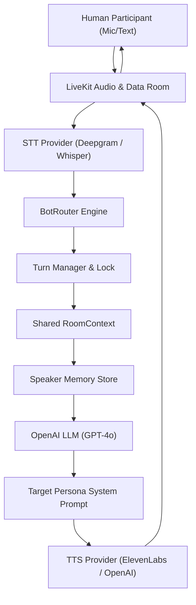

# Roxstar AI Voice Room Assistant

A real-time, event-driven voice AI room assistant system powered by **LiveKit**, **Next.js**, **FastAPI**, **OpenAI**, **Deepgram**, and **ElevenLabs**. Features two distinct Indian AI voice personas (**Roxstar AI Dost** and **Roxstar AI Sathi**) capable of multi-turn Hinglish/Hindi/English conversation, speaker-isolated memory, barge-in interruption, and turn-managed single-speaker lock.

---

## 1. Project Overview
Roxstar AI Voice Room Assistant allows multiple human participants (e.g. Rahul and Priya) to join a real-time LiveKit audio room where two distinct Indian AI personas participate as active room members. The system understands spoken and typed Hindi, Hinglish (Roman Hindi), and English, remembers speaker-specific facts without cross-talk, selectively responds only when addressed or contextually relevant, and supports instant speech interruption/barge-in.

---

## 2. Features
- **Dual Indian AI Personas**:
  - **Roxstar AI Dost** (Male): Casual, friendly, knowledgeable buddy persona using natural Hinglish.
  - **Roxstar AI Sathi** (Female): Warm, expressive, conversational persona.
- **Selective Response & Bot Routing**: Bots do not answer every human sentence. Ignores casual human-to-human small talk (e.g. "Kal cricket match dekha?"). Supports explicit bot addressing and sequential dual-bot turns.
- **Single-Speaker Turn Manager**: Atomic `ResponseState` lock (`IDLE`, `THINKING`, `SPEAKING`, `INTERRUPTED`, `COOLDOWN`) preventing simultaneous bot speech.
- **Barge-in / Interruption**: Instantly detects user speech during bot playback, cancels active TTS streams, and processes new requests.
- **Multi-Turn Room Context & Isolated Speaker Memory**: Remembers topic flow and speaker-specific facts (e.g., Rahul's preferences vs Priya's preferences).
- **Demo-Ready Modern UI**: Dark-themed Next.js UI showing active participants, speaking indicators, live transcript history, text chat, audio controls, and latency telemetry overlay.

---

## 3. Architecture



---

## 4. Tech Stack
- **Frontend**: Next.js 14, React 18, TypeScript, Tailwind CSS, `@livekit/components-react`, `livekit-client`, Lucide Icons.
- **Backend**: Python 3.10+, FastAPI, Uvicorn, Pydantic v2, PyJWT.
- **Real-Time Audio**: LiveKit Server & WebRTC Data Channels.
- **STT**: Deepgram Nova-2 / OpenAI Whisper / Mock Fallback.
- **LLM**: OpenAI GPT-4o / GPT-4o-mini.
- **TTS**: ElevenLabs Multilingual v2 / OpenAI TTS.

---

## 5. Folder Structure
```
roxstar-ai/
├── frontend/             # Next.js UI application
│   ├── app/              # App router pages & layouts
│   ├── components/       # UI components (Room, Transcript, Participants, Chat)
│   ├── lib/              # API and LiveKit client utilities
│   └── types/            # TypeScript type definitions
├── backend/              # Python FastAPI & Agent Server
│   ├── agents/           # Personas (Dost, Sathi), Router, TurnManager, Context, Memory
│   ├── services/         # STT, LLM, TTS, LiveKit JWT service integrations
│   ├── config.py         # App configuration & env loader
│   └── main.py           # FastAPI entry point
├── tests/                # Automated pytest suite & scenario runner
├── docs/                 # Architectural specifications & Mermaid diagrams
├── .env.example          # Environment variables template
├── docker-compose.yml    # Docker container deployment setup
└── README.md             # Project documentation
```

---

## 6. Prerequisites
- Node.js 18+ and npm
- Python 3.10+ and pip
- (Optional) Docker & Docker Compose
- (Optional) LiveKit Cloud or local LiveKit server instance

---

## 7. LiveKit Setup
1. **Cloud Setup**: Sign up at [livekit.io](https://livekit.io) and create a project.
2. Obtain your `LIVEKIT_URL` (e.g. `wss://your-domain.livekit.cloud`), `LIVEKIT_API_KEY`, and `LIVEKIT_API_SECRET`.
3. **Local Setup**: Run `docker-compose up livekit` to start a local LiveKit instance on `ws://localhost:7880`.

---

## 8. API Provider Setup
- **OpenAI**: Get API key from [platform.openai.com](https://platform.openai.com).
- **Deepgram**: Get STT API key from [console.deepgram.com](https://console.deepgram.com).
- **ElevenLabs**: Get TTS API key and voice IDs from [elevenlabs.io](https://elevenlabs.io).

---

## 9. Environment Variables
Copy `.env.example` to `.env` in the root folder:

```bash
LIVEKIT_URL=ws://localhost:7880
LIVEKIT_API_KEY=devkey
LIVEKIT_API_SECRET=secret

NEXT_PUBLIC_LIVEKIT_URL=ws://localhost:7880
NEXT_PUBLIC_BACKEND_URL=http://localhost:8000

OPENAI_API_KEY=your_openai_api_key_here
LLM_MODEL=gpt-4o

STT_PROVIDER=deepgram
STT_API_KEY=your_deepgram_api_key_here

TTS_PROVIDER=elevenlabs
TTS_API_KEY=your_elevenlabs_api_key_here

TTS_MALE_VOICE_ID=male_indian_voice_id_dost
TTS_FEMALE_VOICE_ID=female_indian_voice_id_sathi
```

---

## 10. Installation

### Backend Setup
```bash
cd backend
python -m venv venv
# On Windows:
venv\Scripts\activate
# On Linux/macOS:
source venv/bin/activate

pip install -r requirements.txt
```

### Frontend Setup
```bash
cd frontend
npm install
```

---

## 11. Local Development
To run both backend and frontend locally:

### 12. Start AI Backend Server
```bash
cd backend
python main.py
```
*Backend runs on `http://localhost:8000`.*

### 13. Start Frontend Development Server
```bash
cd frontend
npm run dev
```
*Frontend runs on `http://localhost:3000`.*

---

## 14. How to Create / Join a Room
1. Open `http://localhost:3000` in your web browser.
2. Enter your display name (e.g., `Rahul`).
3. Enter Room ID (e.g., `roxstar-voice-room-1`).
4. Click **Join Voice Room**.

---

## 15. How to Test with 2 Human Participants
1. Open Window 1: `http://localhost:3000`, enter name `Rahul`, join room `roxstar-voice-room-1`.
2. Open Window 2 (or Incognito): `http://localhost:3000`, enter name `Priya`, join room `roxstar-voice-room-1`.
3. Observe both human participants (`Rahul` and `Priya`) alongside AI bots (`Roxstar AI Dost` and `Roxstar AI Sathi`) in the participants roster.

---

## 16. Demo Scenarios
Run the automated scenario test script:
```bash
python tests/run_scenarios.py
```
This executes all 7 mandatory scenarios:
1. **Hindi/Hinglish Query**: "AI kya hota hai?" -> Natural Hinglish response.
2. **English Query**: "Can you explain cloud computing?" -> Hinglish response with technical terms.
3. **Pronoun Context Resolution**: "Shah Rukh Khan ke baare mein batao" -> "Unki koi famous movie batao".
4. **Multi-User Context**: Rahul asks "AI kya hota hai?", Priya follows up with "Thoda aur simple batao".
5. **Speaker-Specific Memory**: Rahul tells his name/cricket preference; asks later "Maine apne baare mein kya bataya tha?" -> Recalls Rahul's facts without mixing Priya's data.
6. **Interruption / Barge-in**: User interrupts active bot speech with "Ruko, simple example se samjhao".
7. **Dual-Bot Sequential**: "AI Dost pehle answer karo, AI Sathi baad mein example dena".

---

## 17. Bot Routing Strategy
The `BotRouter` determines turn ownership:
- **Explicit Addressing**: Direct mentions of `AI Dost` or `AI Sathi`.
- **Relevance Detection**: Ignores casual human chatter ("Kal match dekha?") so bots remain silent.
- **Topic Continuation**: Follow-up questions ("Thoda simple batao") route to the previously active bot.
- **Sequential Scheduling**: Dual bot requests trigger sequential execution (`Dost` then `Sathi`).

---

## 18. Context Strategy
- `RoomContext` maintains a sliding window of recent conversation turns (max 20 turns) to prevent LLM context bloating.
- `SpeakerMemory` stores participant facts strictly indexed by `participant_id` for memory isolation.

---

## 19. Interruption Strategy
- The `TurnManager` maintains an atomic lock (`ResponseState`).
- When a user speaks while a bot is in `THINKING` or `SPEAKING` state, `handle_interruption()` fires cancellation callbacks, stops TTS streaming, releases lock, and processes the new turn immediately.

---

## 20. Observability & Telemetry
Every turn logs structured performance metrics:
```text
[VOICE REQUEST] Speaker: Rahul | Input: 'AI kya hota hai?' | Selected Bot: Roxstar AI Dost | STT: 420ms | LLM: 650ms | TTS: 720ms | Total: 1.79s
```
Metrics are displayed in real-time on the UI's telemetry overlay bar.

---

## 21. Failure Handling
- **Missing API Keys**: Gracefully falls back to mock STT, LLM, and TTS generators without crashing.
- **LiveKit Disconnects**: Auto-reconnect mechanisms with UI connection status indicator.
- **Empty / Duplicate Transcripts**: Filtered by backend router before LLM invocation.

---

## 22. Security
- Secrets and API keys are stored strictly in `.env` and never committed to source control.
- LiveKit JWT tokens are generated on the server with short expiration windows (24h).

---

## 23. Privacy
- **No Raw Audio Retention**: Raw room audio is processed in-memory and never stored to disk.
- **Session Memory Scope**: Memory is stored per-session in memory stores and can be cleared on room disconnect.

---

## 24. Cost Considerations
- **Selective Bot Response**: Saves ~60% in LLM/TTS API costs by remaining silent during human-to-human small talk.
- **Context Truncation**: Limits sliding window history length to minimize OpenAI token consumption.

---

## 25. Known Limitations
- Standalone development mode uses fallback REST/WS data channel polling when LiveKit Agent server worker is running without LiveKit Cloud CLI binary.

---

## 26. Future Improvements
- Support for persistent PostgreSQL vector memory storage across room sessions.
- Direct WebRTC native C++ audio frame streaming for sub-500ms voice latencies.
