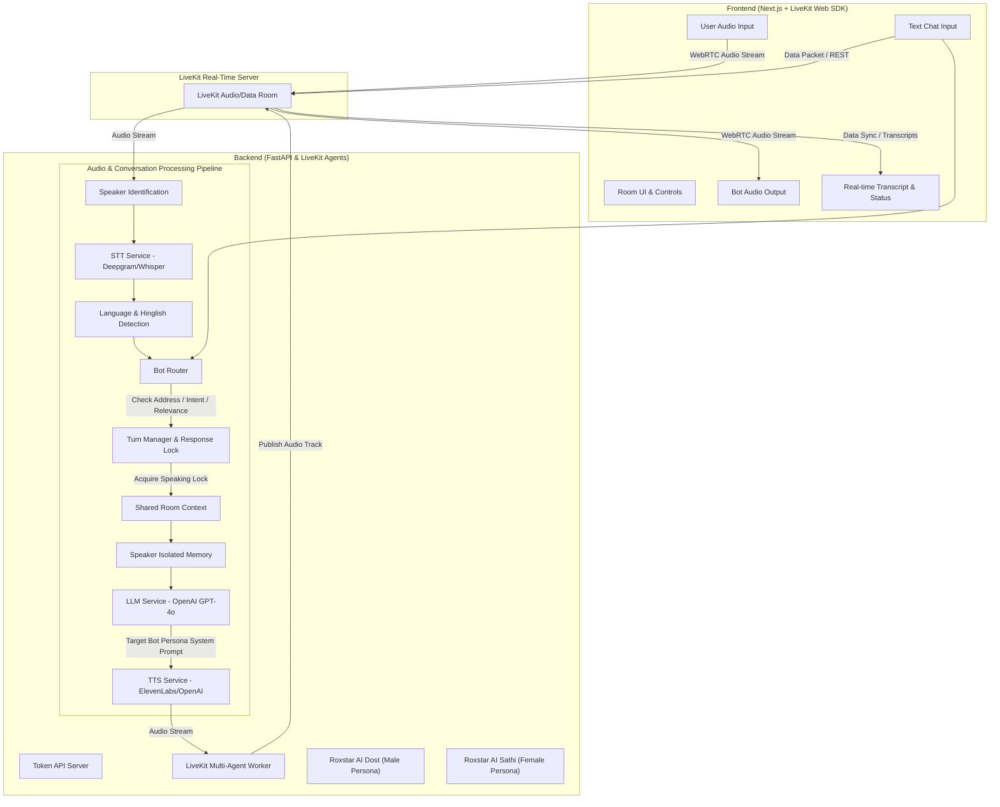

# Roxstar AI Voice Room Assistant - Architecture Overview

## 1. High-Level Architecture

The Roxstar AI Voice Room Assistant is built on a real-time, event-driven audio and data pipeline using LiveKit, Next.js, and Python FastAPI microservices.

## 2. Core Components

### A. LiveKit Audio & Data Layer
- **Room Topology**: Supports multiple human participants and 2 distinct AI bot participants (`roxstar-ai-dost`, `roxstar-ai-sathi`).
- **Data Channels**: Transmits real-time transcriptions, active bot states, latency metrics, and text chat messages.

### B. STT (Speech-to-Text)
- Configured for multi-lingual Indian speech (Hindi, Hinglish, English).
- Production default: Deepgram Nova-2 / OpenAI Whisper.
- Streams user voice turns into recognized text.

### C. Bot Router & Intent Engine
- Evaluates if speech/text requires bot intervention.
- Determines whether **AI Dost**, **AI Sathi**, both sequentially, or neither should respond.
- Filters human-to-human banter ("Kal match dekha?") so bots remain silent when not needed.

### D. Turn Manager & Speaking Lock
- Enforces single-speaker lock (`ResponseState`: `IDLE`, `THINKING`, `SPEAKING`, `INTERRUPTED`, `COOLDOWN`).
- Handles user barge-in by immediately sending cancellation signal to TTS and clearing lock.

### E. Multi-Turn Context & Speaker Memory
- `RoomContext`: Sliding conversational window, current topic, last user/bot turn.
- `SpeakerMemory`: Isolated per participant (`participant_id`, `name`, `facts`, `preferences`). Prevents cross-talk or mixing information between users (e.g. Rahul vs Priya).

### F. Personas & Prompts
- **Roxstar AI Dost**: Male, friendly, casual Hinglish/Hindi, knowledgeable buddy style.
- **Roxstar AI Sathi**: Female, warm, expressive, natural Indian conversational style.

### G. TTS (Text-to-Speech)
- High-quality Indian accents configured with separate male/female voice IDs via `.env`.
