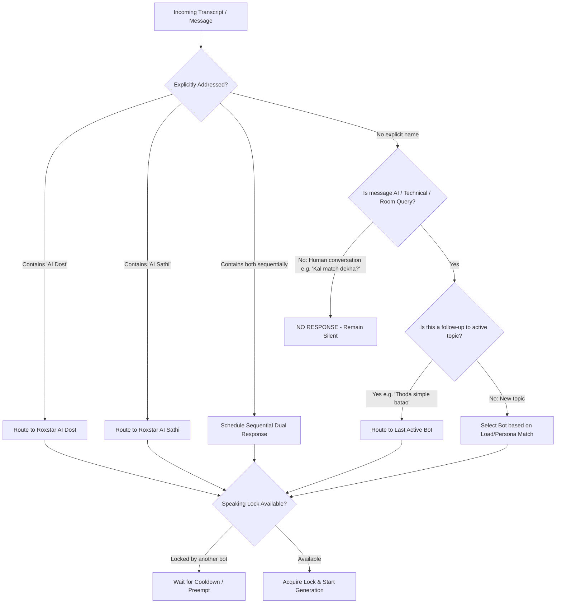

# Bot Router Specifications

## Bot Routing Architecture

The `BotRouter` determines which bot (if any) responds to incoming transcriptions or text chat messages.

## Routing Rules Summary

| Condition | Example Input | Target Action |
| :--- | :--- | :--- |
| **Explicit Addressed - Dost** | "AI Dost, tum answer karo." | `roxstar-ai-dost` responds |
| **Explicit Addressed - Sathi** | "AI Sathi, iska example do." | `roxstar-ai-sathi` responds |
| **Dual Sequential Request** | "AI Dost pehle answer karo, AI Sathi example dena." | 1. `roxstar-ai-dost` responds 2. `roxstar-ai-sathi` follows up with example |
| **General AI Query** | "AI kya hota hai?" | System selects `roxstar-ai-dost` or `roxstar-ai-sathi` based on persona round-robin |
| **Topic Follow-up** | "Thoda aur simple batao." | Continues with whichever bot answered the previous turn |
| **Non-AI Human-to-Human** | "Kal cricket match dekha?" | Silent (No bot responds) |
| **Speaker Memory Retrieval** | "Maine apne baare mein kya bataya tha?" | Reads speaker-specific memory for current speaker identity only |
