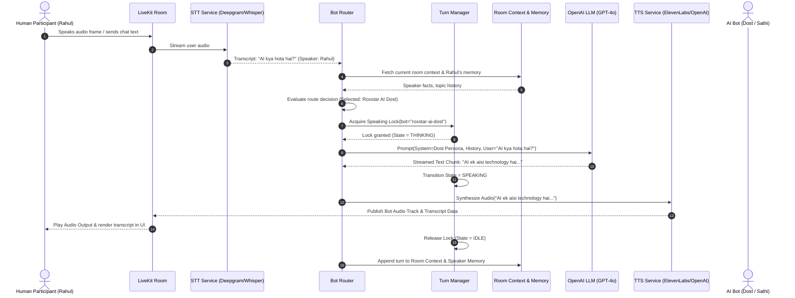
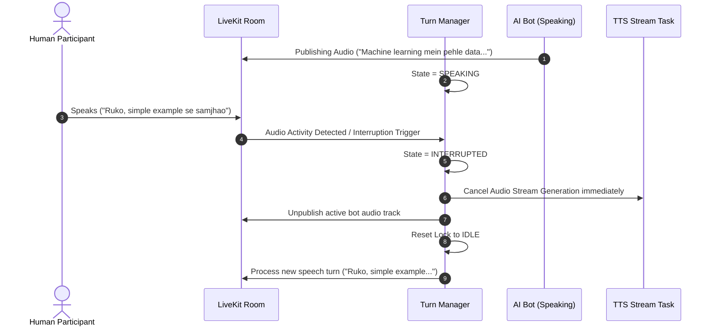

# Sequence Diagrams

## 1. End-to-End Voice & Text Request Sequence

```mermaid
sequenceDiagram
    autonumber
    actor User as Human Participant (Rahul)
    participant LK as LiveKit Room
    participant STT as STT Service (Deepgram/Whisper)
    participant Router as Bot Router
    participant Turn as Turn Manager
    participant Ctx as Room Context & Memory
    participant LLM as OpenAI LLM (GPT-4o)
    participant TTS as TTS Service (ElevenLabs/OpenAI)
    actor Bot as AI Bot (Dost / Sathi)

    User->>LK: Speaks audio frame / sends chat text
    LK->>STT: Stream user audio
    STT-->>Router: Transcript: "AI kya hota hai?" (Speaker: Rahul)
    
    Router->>Ctx: Fetch current room context & Rahul's memory
    Ctx-->>Router: Speaker facts, topic history
    
    Router->>Router: Evaluate route decision (Selected: Roxstar AI Dost)
    
    Router->>Turn: Acquire Speaking Lock(bot="roxstar-ai-dost")
    Turn-->>Router: Lock granted (State = THINKING)
    
    Router->>LLM: Prompt(System=Dost Persona, History, User="AI kya hota hai?")
    LLM-->>Router: Streamed Text Chunk: "AI ek aisi technology hai..."
    
    Turn->>Turn: Transition State = SPEAKING
    Router->>TTS: Synthesize Audio("AI ek aisi technology hai...")
    TTS-->>LK: Publish Bot Audio Track & Transcript Data
    LK-->>User: Play Audio Output & render transcript in UI
    
    Turn->>Turn: Release Lock (State = IDLE)
    Router->>Ctx: Append turn to Room Context & Speaker Memory
```

## 2. Interruption / Barge-in Sequence

```mermaid
sequenceDiagram
    autonumber
    actor User as Human Participant
    participant LK as LiveKit Room
    participant Turn as Turn Manager
    participant Bot as AI Bot (Speaking)
    participant TTS as TTS Stream Task

    Bot->>LK: Publishing Audio ("Machine learning mein pehle data...")
    Turn->>Turn: State = SPEAKING
    
    User->>LK: Speaks ("Ruko, simple example se samjhao")
    LK->>Turn: Audio Activity Detected / Interruption Trigger
    
    Turn->>Turn: State = INTERRUPTED
    Turn->>TTS: Cancel Audio Stream Generation immediately
    Turn->>LK: Unpublish active bot audio track
    Turn->>Turn: Reset Lock to IDLE
    
    Turn->>LK: Process new speech turn ("Ruko, simple example...")
```
